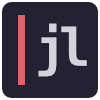

# 

[](https://goreportcard.com/report/github.com/koenbollen/jl)
[](https://circleci.com/gh/koenbollen/jl)

**`jl` is a development tool for working with structured JSON logging.**

Modern applications quite often use structured logging instead of simple log
messages. This is preferable for computer systems but not for humans. `jl` will
help development by translating structured message into old-fashioned log lines.

## Examples

A code snippets says more than a thousand words:

    $ myprogram
    {"message": "Hello, world!!", "severity": "info"}
    {"message": "skipping file", "severity": "warn", "file": "empty.txt"}

    $ myprogram | jl
       INFO: Hello, world!!
    WARNING: skipping file [file=empty.txt]

([more examples](https://github.com/koenbollen/jl/tree/master/examples))

## Installation

```bash
$ brew install koenbollen/public/jl
$ echo '{"msg": "It works!"}' | jl
It works!
```

Alternatively you can fetch a binary from the
[latest release](https://github.com/koenbollen/jl/releases) or install the
latest development version from source: `go get -u github.com/koenbollen/jl`

## Usage

```
Usage:
  jl [options] [FILE...]

Options:
  -h, --help    Show this screen.
  --version     Show version.

Output Options:
  --color           Force colorized output
  --no-color        Don't colorize output
  --skip-prefix     Skip printing truncated bytes before the JSON
  --skip-suffix     Skip printing truncated bytes after the JSON

Formatting Options:
  --skip-fields     Don't output misc json keys as fields
  --include-fields  <fields>, -f <fields> Always include these json keys as fields (comma seperated list)

You can add any option to the JL_OPTS environment variable, ex:
  export JL_OPTS="--no-color"
```

## Compatibility

`jl` tries to dynamically parse the lines to support as many well
known formats as possible.

Is `jl` not compatible with your structured logging? Please let me
know by [creating an issue](https://github.com/koenbollen/jl/issues/new).
